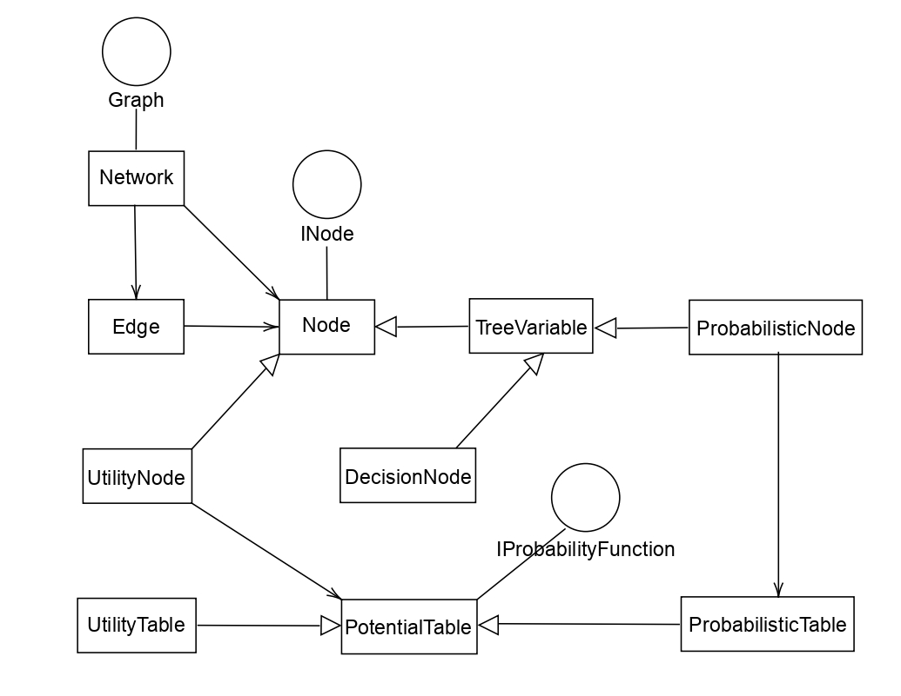
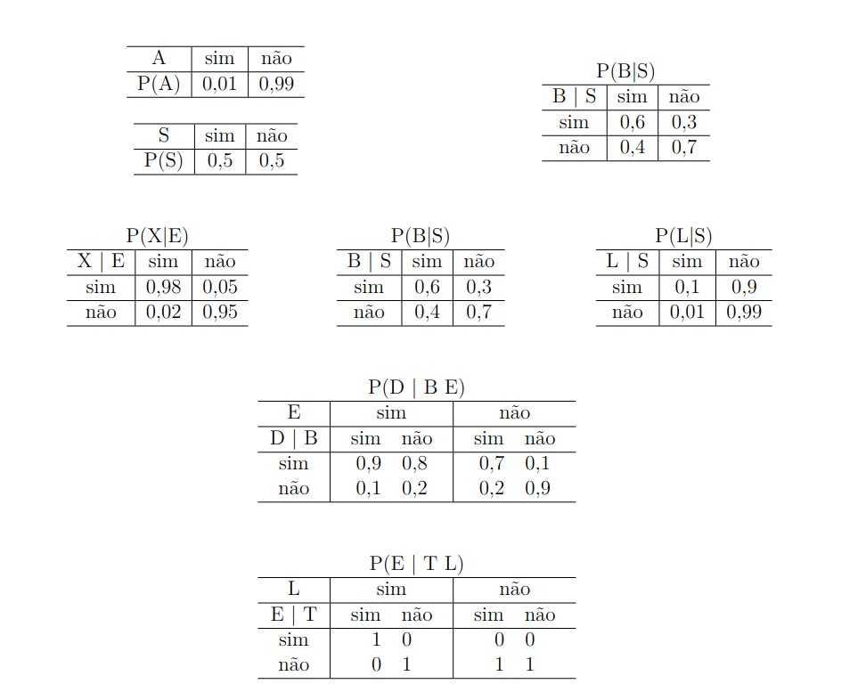
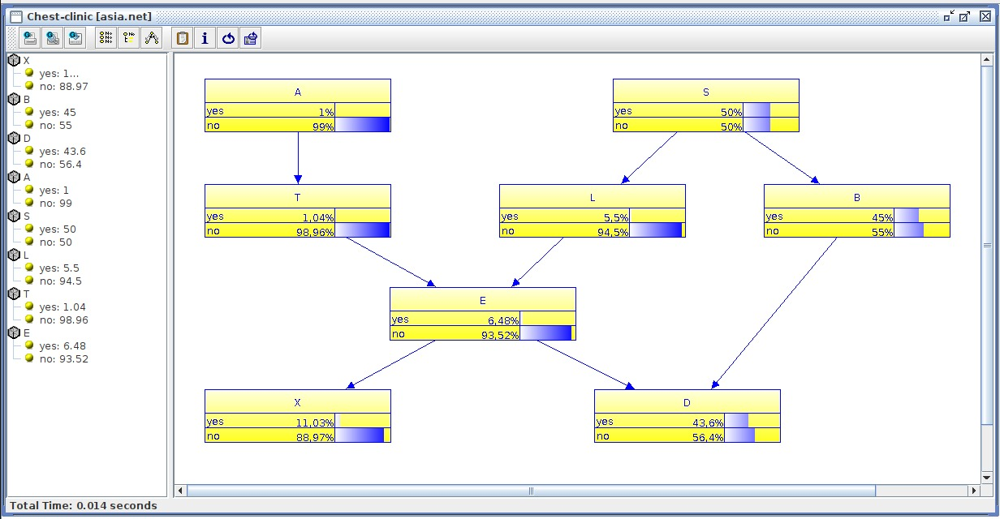
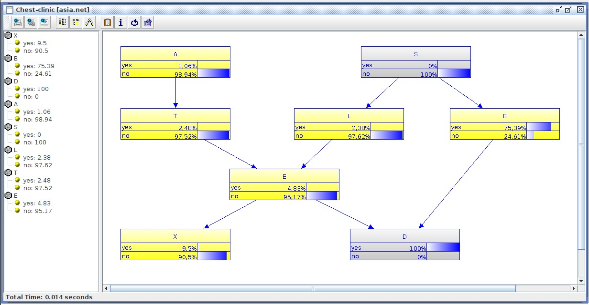
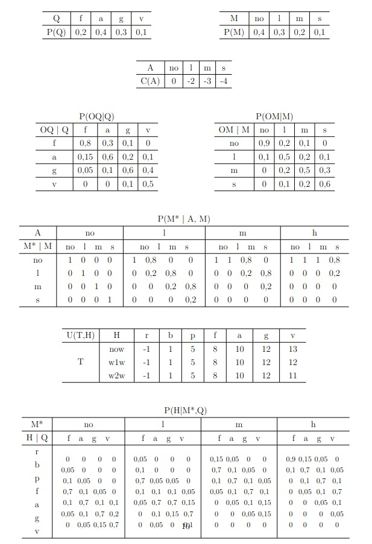
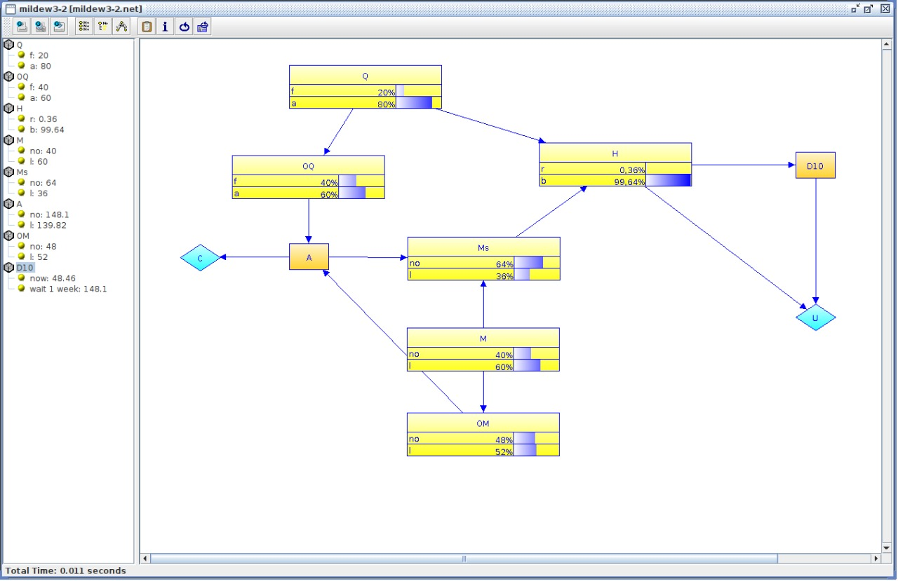
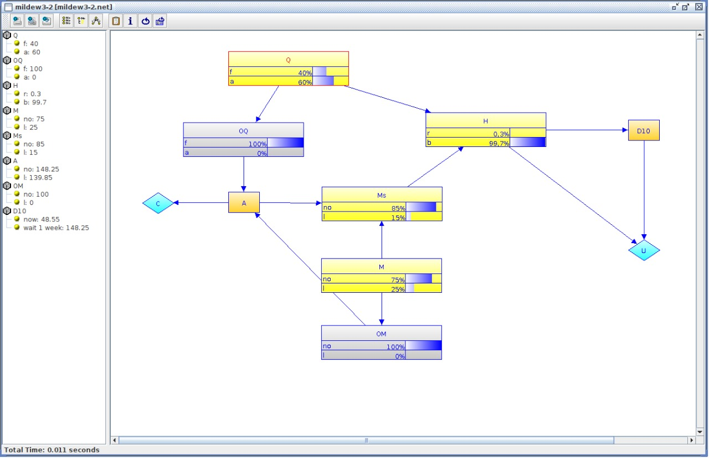
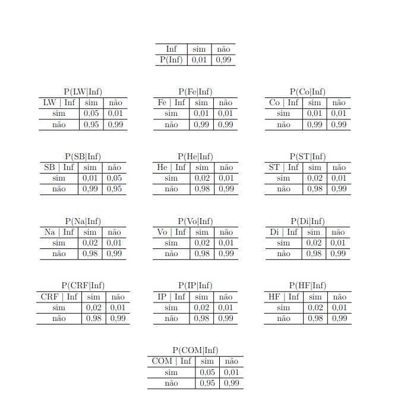
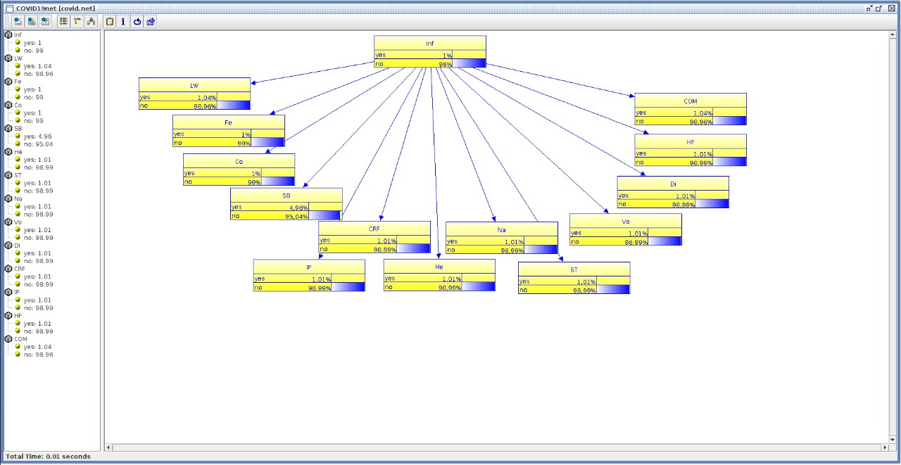
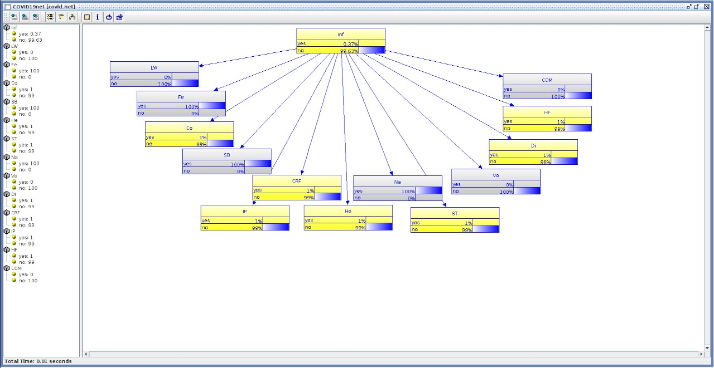

# UnBBAyes Python API

Esse projeto implementa uma API em Python para o framework UnBBayes.

O UnBBayes é um framework em Java desenvolvido na UnB que permite modelar e manipular modelos gráficos probabilísticos. O intuito da API em Python é disponibilizar como um pacote de Programação Probabilística para a linguagem.

Autor: Felipe Gomes Paradas
Matricula: 17/0009840

---

## Como rodar os exemplos

Para conseguir rodar o projeto, é necessário, além de uma instalação do SDK Java 8, Python3 e do pip3, instalar as depêndencias do projeto, ou seja, o pacote Py4J. Para isso, basta acessar o terminal da raiz do projeto e rodar o seguinte comando:

```sh
pip3 install requirements.txt
```

Após garantir que a instalação do pacote Py4J foi realizada, basta executar um dos exemplos disponíveis com o comando python3 da raíz do projeto.

```python
python3 <exemplo>
```

---
## Dependências do projeto

Para a execução do projeto, foram utilizados dois principais pacotes. O primeiro, UnBBayes possui a API em Java que será consumida para a disponibilização dos algoritmos e o segundo, o Py4J, que permite realizar chamadas na JVM dentro do código Python.

### UnBBayes

O UnBBayes é um framework para modelos probabilísticos em inteligência artificial desenvolvido dentro da UnB que disponibiliza tanto uma interface gráfica, quanto um sistema de plugins e até mesmo uma interface de programação de aplicativos (API) Java para integração com outros programas desenvolvidos.

#### Modelo de classes

Em sua API, temos acesso as seguintes classes:




- Graph: interface para grafos construídos sob um conjunto de nós e arestas.

- Network: implementação concreta de uma rede genérica. Se uma rede é composta por nós probabilísticos, usar ProbabilisticNetork (uma extensão de Network) seria útil.

- Edge: é a classe que representa uma aresta entre dois nós.Ao modelar a relação como uma classe separada se torna possível usar atributos, permitindo tratamento diferente por outras classes.

- INode: INode: interface para representar um nó genérico.

- ProbabilisticNode: representa um nó probabilístico.

- UtilityNode: um nó de utilidade para Diagramas de Influência (IDs).

- UtilityTable: representa a função de utilidade para IDs (que é representado como uma tabela no UnBBayes)

- DecisionNode: um nó de decisão para IDs.

- IProbabilityFunction: uma interface para objetos que especificam a distribuição de probabilidade de um nó.

- PotentialTable: classe abstrata que representa IProbabilityFunciton em formato de tabela.

- ProbabilisticTabel: tabelas de probabilidade condicional para BNs.

#### Métodos disponíveis

A API do framework UnBBayes disponibiliza diversos métodos para modelos probabilísticos gráficos e é possível dividi-los em duas principais categorias:

- PRS: nesse pacote encontram-se os métodos referentes a computação de modelos probabilísticos gráficos.

- IO: nessa categoria estão os métodos referentes a leitura e escrita de arquivos externos

### Py4J

Py4J é uma ferramente que possibilita que programas em Python sendo executados no interpretador Python acessem, de forma dinâmica, objetos Java em uma Máquina Virtual Java. A ferramenta também permite o acesso inverso, programas Java fazerem chamadas para objetos Python, mas o foco será na primeira funcionalidade.

A bibliotéca não executa o código Python na JVM, o que Py4J usa são conexões em "sockets" para comunicar a JVM com o interpretador Python e, para isso, é necessário implementar uma porta de entrada em Java chamando a bibliotéca e expondo o programa para o interpretador Python.

Esse pacote será utilizado para permitir o consumo da API do UnBBayes em Java dentro do Python. 

---

## Funções desponibilizadas na API Python

A API em Python tem três principais responsabilidades. A primeira é encapsular as interações com a JVM de forma com que o usuário não precise saber quais conexões e chamadas estão sendo feitas, além de garantir que será mantido apenas um processo da JVM rodando e esse processo será terminado ao final do script Python.

Para essa cumprir com essa responsabilidade, é criado uma classe seguindo o padrão de desenho `singleton`, o que consegue garantir apenas uma instância JVM sendo executada por programa Python. Além disso, algumas funções disponibilizadas pelo próprio Py4J cuidam do desligamento do processo ao final.

```python
class Singleton(type):
    _instances = {}
    def __call__(cls, *args, **kwargs):
        if cls not in cls._instances:
            cls._instances[cls] = super(Singleton, cls).__call__(*args, **kwargs)
        return cls._instances[cls]

class UnBBayes(metaclass=Singleton):

    def __init__(self):

        cwd = os.getcwd()

        unbbayes_path = None
        for filename in os.listdir(os.path.join(cwd, 'unbbayes', 'lib', 'unbbayes')):
            if re.match('unbbayes.*\.jar', filename):
                unbbayes_path = os.path.join(cwd, 'unbbayes', 'lib', 'unbbayes', filename)

        print(unbbayes_path)


        self._gateway = JavaGateway.launch_gateway(classpath=unbbayes_path, die_on_exit=True)
        self._prs = self._gateway.jvm.unbbayes.prs
        self._io = self._gateway.jvm.unbbayes.io
```

Sua segunda responsabilidade é disponibilizar classes objetos para que os usuários consigam representar os nós e suas redes com maior facilidade. São implementadas duas classes simples para isso, Node e Network.

```python
class Network:
    def __init__(self, jNet):
        self.net = jNet
        self.compiled = False

class Node:
    def __init__(self, name: str, parents: List[str], states: List[str], cpt: List[float]):
        self.name = name
        self.parents = parents
        self.states = states
        self.probs = cpt
```


E, por fim, sua terceira responsabilidade é fornecer funções para o programador realizar as computações dos modelos sem precisar se importar com a implementação. As seguintes funções são disponibilizadas:


- create_java_node
    ```python
    def create_java_node(self, node: Node)
    ```

    Aceita um nó Python como entrada, cria seu equivalente na JVM e retorna essa referência.

- add_node
    ```python
    def add_node(self, network: Network, node: Node)
    ```

    Aceita como entrada um nó e uma rede, adiciona o nó a esta rede e a retorna.


- create_network
    ```python
    def create_network(self, name: str, nodeList: List[Node])
    ```

    Aceita como entrada o nome da rede e uma lista de nós, cria uma rede baseada baseada na lista de nós e a retorna.

- create_network_from_file
    ```python
    def create_network_from_file(self, path: str)
    ```

    Aceita como entrada o caminho para um arquivo `.net`, cria uma rede a partir dele e a retorna.

- save_network
    ```python
    def save_network(self, path: str, network: Network)
    ```

    Aceita como entrada o caminho onde a rede será salva e a rede em si. Salva a rede no formato `.net` no caminho especificado.

- print_network
    ```python
    def print_network(self, network: Network)
    ```

    Imprime no terminal a rede passada como entrada.

- compile_network
    ```python
    def compile_network(self, network: Network)
    ```

    Compila a rede passada como entrada.

- set_evidence
    ```python
    def set_evidence(self, pyNet: Network, evidences)
    ```

    A partir das novas evidências passadas como entrada, atualiza as probabilidades presentes na rede passada como entrada.

- propagate_evidence
    ```python
    def propagate_evidence(self, pyNet: Network)
    ```

    Propaga as evidências que foram atualizadas na rede passada como entrada.

---

## Modelos exemplos

Para este trabalho, três exemplos principais foram implementados. O modelo e implementação de cada exemplo será explicado dentro dessa sessão.

### Asia

Asia é um famoso exemplo de aplicação de redes bayesianas, nele estão presentes 8 nós probabilísticos e suas relações. Esses nós são:

- A: "Visitou a Ásia?"
- S: "É fumante?"
- T: "Tem tuberculose?"
- L: "Tem cancêr de pulmão?"
- B: "Tem bronquite?"
- E: "Tem câncer ou tuberculose?"
- X: "Tem raio-x positivo?"
- D: "Tem dispneia?"

Cada uma dessas variáveis podem assumir os valores "sim" e "não" e se relacionam da seguinte forma:

- A influencia diretamente T
- S influencia L e B
- T e L influenciam E
- E e B influenciam D
- E também influencia X



Utilizando as relações e a tabela de probabilidade condicional (CPT), dentro da interface gráfica do UnBBayes é possível montar a seguinte rede:



Para implementar utilizando a API em Python desenvolvida, primeiro é necessário especificar os nós e, com isso, seus estados possíveis, o nome dos nós que exercem influência sobre ele e suas tabelas de probabilidade condicional. Com isso, define-se:

```python
nodeList = [
    Node(name="asia", parents=[], states=["yes", "no"], cpt=[0.01, 0.99]),
    Node(name="tub", parents=["asia"], states=["yes", "no"], cpt=[0.05, 0.95, 0.01, 0.99]),
    Node(name="smoke", parents=[], states=["yes", "no"], cpt=[0.5,0.5]),
    Node(name="lung", parents=["smoke"], states=["yes", "no"], cpt=[0.1, 0.9, 0.01, 0.99]),
    Node(name="bronc", parents=["smoke"], states=["yes", "no"], cpt=[0.6, 0.4, 0.3, 0.7]),
    Node(name="either", parents=["lung", "tub"], states=["yes", "no"], cpt=[1,0,1,0,1,0,0,1]),
    Node(name="xray", parents=["either"], states=["yes", "no"], cpt=[0.98, 0.02, 0.05, 0.95]),
    Node(name="dysp", parents=["bronc", "either"], states=["yes", "no"], cpt=[0.9, 0.1, 0.7, 0.3, 0.8, 0.2, 0.1, 0.9]),
]
```

Após a criação desses nós, basta criar a rede e compilá-la, caso também queira imprimir na tela o resultado, basta utilizar a função `print_network`:

```python
net = unb.create_network("Asia.net", nodeList)

net = unb.compile_network(net)

unb.print_network(net)
```

Com isso, o resultado obtido é:

```
X: Positive X-ray?
yes : 0.11029005
no : 0.88971
----
B: Has bronchitis
yes : 0.45000002
no : 0.55
----
D: Dyspnoea?
yes : 0.43597063
no : 0.5640294
----
A: Visit to Asia?
yes : 0.009999999
no : 0.98999995
----
S: Smoker?
yes : 0.5
no : 0.5
----
L: Has lung cancer
yes : 0.055000007
no : 0.945
----
T: Has tuberculosis
yes : 0.010399999
no : 0.9896
----
E: Tuberculosis or cancer
yes : 0.06482801
no : 0.935172
----
```

É possível notar que os valores obtidos são os mesmos valores presentes na rede criada na interface gráfica do UnBBayes, porém arredondados. Também é possível se atualizar as evidências e propagá-las sobre a rede. No caso em que novas evidências de que o paciente não é fumante e tem dispnéia a rede pode ser atualizada da seguinte forma:

```python
net = unb.propagate_evidence(unb.set_evidence(net, [("dysp", "yes"), ("smoke", "no")]))
```

E ao imprimir essa rede na tela, obtém-se os seguintes resultados:

```
X: Positive X-ray?
yes : 0.09495054
no : 0.9050495
----
B: Has bronchitis
yes : 0.753945
no : 0.24605496
----
D: Dyspnoea?
yes : 1.0
no : 0.0
----
A: Visit to Asia?
yes : 0.010552802
no : 0.98944724
----
S: Smoker?
yes : 0.0
no : 0.99999994
----
L: Has lung cancer
yes : 0.0238145
no : 0.97618544
----
T: Has tuberculosis
yes : 0.024767082
no : 0.97523296
----
E: Tuberculosis or cancer
yes : 0.048333913
no : 0.95166606
----
```

Realizando o mesmo procedimento de atualização de crença na interface gráfica do UnBBayes, consegue-se a seguinte rede:



Ainda é possível notar que os valores são os mesmos encontrados na API Python, porém atualizados.

[3] UnBBayes: a Java Framework for Probabilistic Models in AI

### Mildew 3.2

Mildew é um exemplo famoso de aplicação de diagramas de influência (IDs). Aqui, dois meses antes da colheita de trigo o agricultor observa o estado da espiga para ver se está atacado pelo fungo Míldio e deve decidir sobre o tratamento do plantio. Para esse problema, as seguintes variáveis probabilísticas são mapeadas:

- Q: "Estado da espiga", com estados razoável (f), médio (a), bom (g) e muito bom (v)
- OQ: "Observação do estado da espiga", com estados razoável, médio, bom e muito bom
- M: "Ataque atual", com estados não (no), leve (l), moderado (m) e severo (h)
- OM: "Observação do ataque atual", com estados não, leve, moderado e severo
- M*: "Danos após tratamento", com estados não, leve, moderado e severo
- H: "Estado da espiga na época de colheita", com estados muito ruim (r), ruim (b), inferior (p), razoável, médio, bom e muito bom

As seguintes variáveis de decisão são utilizadas:

- A: "Tratamento", com as ações não, leve, moderado e forte
- T: "Época de colheita", com as ações agora (now), espere uma semana (w1w) e espere duas semanas (w2w)

E as funções de utilidade, com a mesma escala de valores, consideradas são:

- C(A): "Custo do tratamento com fungicida"
- U(H, T): "Valor total da safra"

A partir desses nós, existem as seguintes relações de influência estabelecidas:

- Q influencia OQ e H
- OQ influencia A
- M influencia M* e OM
- OM influencia A
- M* influencia H
- H influencia T e U(H, T)
- A influencia M* e C(A)
- T influencia U(H, T)



Utilizando as relações e a tabela de probabilidade condicional (CPT), dentro da interface gráfica do UnBBayes é possível montar a seguinte rede:



Dentro da interface gráfica do UnBBayes é possível baixar a rede como um arquivo `.net` ao fazer isso, para carregar a rede e compilá-la na API Python é tão simples quanto:

```python
net = unb.create_network_from_file("examples/mildew3-2.net")

net = unb.compile_network(net)
```

Caso se imprima a rede se obtém os seguintes resultados:

```
Q: Q
f : 0.20000003
a : 0.8
----
OQ: 
f : 0.40000004
a : 0.6
----
H: H
r : 0.0036
b : 0.9964
----
M: M
no : 0.39999998
l : 0.6
----
Ms: M*
no : 0.64
l : 0.36
----
U: U
A: A
no : 148.1
l : 139.82
----
OM: OM
no : 0.48
l : 0.52
----
C: 
D10: T
now : 48.460003
wait 1 week : 148.1
----
```

Novamete, os mesmos valores visíveis na interface gráfica do UnBBayes. Atualizando a observação da espiga como razoável e o estado do ataque como não e propagando essas evidências no UnBBayes é possível se obter a seguinte rede:



Os mesmos valores podem ser obtidos na API Python ao se atualizar as observações. Isso pode ser feito com o código:

```python
net = unb.propagate_evidence(unb.set_evidence(net, [("OQ", "f"), ("OM", "no")]))

```

Ao se imprimir na tela, o resultado obtido é:

```
Q: Q
f : 0.4
a : 0.6
----
OQ: 
f : 1.0
a : 0.0
----
H: H
r : 0.003
b : 0.997
----
M: M
no : 0.75
l : 0.25
----
Ms: M*
no : 0.85
l : 0.15
----
U: U
A: A
no : 148.25
l : 139.85
----
OM: OM
no : 1.0
l : 0.0
----
C: 
D10: T
now : 48.550007
wait 1 week : 148.25
----
```

[4] Diagrama de Influências Múltiplo Secionado


### COVID19 - Naive Bayes

Uma aplicação interessante das redes bayesianas pode ser no auxilio para diagnóstico de doenças, mais especificamente é possível aplicar esse modelo para o caso de COVID19 através de seus sintomas, bem como a probabilidade de desenvolver os sintomas dado o diagnóstico da doença. Pensando nisso, pesquisadores da Umm Al Qura University, desenvolveram uma rede bayesiana simples com 14 variáveis probabilísticas que podem assumir os valores "sim" e "não". Esses nós são:

- Inf: "Infectado?"
- LW: "Vivendo/Trabalhando em local com presença do coronavirus?"
- COM: "Se comunicou nos últimos 14 dias com algum infectado?"
- Fe: "Sente frebre?"
- Co: "Sente tosse?"
- SB: "Sente perda de ar?"
- He: "Sente dor de cabeça?"
- ST: "Sente dor de garganta?"
- Na: "Sente nausea?"
- Vo: "Vomitou?"
- Di: "Teve diarreia?"
- CRF: "Ocorreu falha crônica renal?"
- IP: "Possui alguma imunosupressão?"
- HF: "Ocorreu falha cardiaca?"

Para essa rede, a relação de influência é muito simples, estar infectado ou não por covid (Inf) influencia todos os outros nós da seguinte forma:



Para definir essa rede na API Python, primeiro é necessário se definir os nós da seguinte forma:

```python
nodeList = [
    Node(name="Inf", parents=[], states=["yes", "no"], probs=[0.01, 0.99]),
    Node(name="LW", parents=["Inf"], states=["yes", "no"], probs=[0.05, 0.95, 0.01, 0.99]),
    Node(name="Fe", parents=["Inf"], states=["yes", "no"], probs=[0.01, 0.99, 0.01, 0.99]),
    Node(name="Co", parents=["Inf"], states=["yes", "no"], probs=[0.01, 0.99, 0.01, 0.99]),
    Node(name="SB", parents=["Inf"], states=["yes", "no"], probs=[0.01, 0.99, 0.05, 0.95]),
    Node(name="He", parents=["Inf"], states=["yes", "no"], probs=[0.02, 0.98, 0.01, 0.99]),
    Node(name="ST", parents=["Inf"], states=["yes", "no"], probs=[0.02, 0.98, 0.01, 0.99]),
    Node(name="Na", parents=["Inf"], states=["yes", "no"], probs=[0.02, 0.98, 0.01, 0.99]),
    Node(name="Vo", parents=["Inf"], states=["yes", "no"], probs=[0.02, 0.98, 0.01, 0.99]),
    Node(name="Di", parents=["Inf"], states=["yes", "no"], probs=[0.02, 0.98, 0.01, 0.99]),
    Node(name="CRF", parents=["Inf"], states=["yes", "no"], probs=[0.02, 0.98, 0.01, 0.99]),
    Node(name="IP", parents=["Inf"], states=["yes", "no"], probs=[0.02, 0.98, 0.01, 0.99]),
    Node(name="HF", parents=["Inf"], states=["yes", "no"], probs=[0.02, 0.98, 0.01, 0.99]),
    Node(name="COM", parents=["Inf"], states=["yes", "no"], probs=[0.05, 0.95, 0.01, 0.99]),
]
```

Após isso, basta criar a rede e compilá-la para obter os primeiros resultados. O código para isso é:

```python
net = unb.create_network("COVID19.net", nodeList)

net = unb.compile_network(net)
```

O resultado obtido ao se imprimir na tela é:

```
Inf: 
yes : 0.01
no : 0.99
----
LW: 
yes : 0.0104
no : 0.98960006
----
Fe: 
yes : 0.01
no : 0.99
----
Co: 
yes : 0.01
no : 0.99
----
SB: 
yes : 0.0496
no : 0.9504
----
He: 
yes : 0.0101
no : 0.98990005
----
ST: 
yes : 0.0101
no : 0.98990005
----
Na: 
yes : 0.0101
no : 0.98990005
----
Vo: 
yes : 0.0101
no : 0.98990005
----
Di: 
yes : 0.0101
no : 0.98990005
----
CRF: 
yes : 0.0101
no : 0.98990005
----
IP: 
yes : 0.0101
no : 0.98990005
----
HF: 
yes : 0.0101
no : 0.98990005
----
COM: 
yes : 0.0104
no : 0.98960006
----
```

Utilizando a função `save_network` é possível salvar a rede criada em um arquivo `.net` e esse arquivo pode ser carregado no UnBBayes. Ao fim do processo, se obtém a seguinte rede:



É possível ver que os resultados novamente são os mesmos aproximados. Para atualizar na API as evidências dessa vez marcando que o paciente não se comunicou e nem frequentou um ambiente com um infectado porém teve febre, falta de ar e naúsea, mas não apresentou vômito segue o código:

```python
net = unb.propagate_evidence(unb.set_evidence(net, [
    ("COM", "no"),
    ("Fe", "yes"),
    ("SB", "yes"),
    ("LW", "no"),
    ("Na", "yes"),
    ("Vo", "no")
    ]))
```
O resultado obtido em tela ao chamar a função `print_network` é:

```
Inf: 
yes : 0.0036694082
no : 0.9963306
----
LW: 
yes : 0.0
no : 1.0
----
Fe: 
yes : 0.99999994
no : 0.0
----
Co: 
yes : 0.01
no : 0.99
----
SB: 
yes : 1.0
no : 0.0
----
He: 
yes : 0.010036694
no : 0.9899633
----
ST: 
yes : 0.010036694
no : 0.9899633
----
Na: 
yes : 1.0
no : 0.0
----
Vo: 
yes : 0.0
no : 1.0
----
Di: 
yes : 0.010036694
no : 0.9899633
----
CRF: 
yes : 0.010036694
no : 0.9899633
----
IP: 
yes : 0.010036694
no : 0.9899633
----
HF: 
yes : 0.010036694
no : 0.9899633
----
COM: 
yes : 0.0
no : 1.0000001
```

Fazendo o mesmo processo na interface gráfica do UnBBayes se obtém os mesmos resultados aproximados. Esse evento pode ser visto na seguinte rede:



[5] Detecting COVID-19 Utilizing Probabilistic Graphical Models

---

## Referências


[1] [UnBBayes](http://unbbayes.sourceforge.net/)

[2] [Py4J](https://www.py4j.org/)

[3] [UnBBayes: a Java Framework for Probabilistic Models in AI](https://www.researchgate.net/publication/229150811_UnBBayes_a_Java_Framework_for_Probabilistic_Models_in_AI)

[4] Diagrama de Influências Múltiplo Secionado

[5] Detecting COVID-19 Utilizing Probabilistic Graphical Models